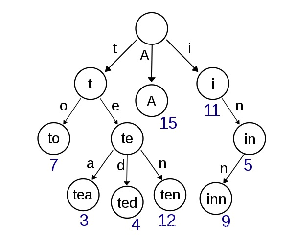

<div className={'img-desc'}>图：Peter Tarka</div>

import Draw from "../../../../src/@narative/gatsby-theme-novela/components/draw";

## 概念

字典树，是一种有序树，用于保存关联数组，其中的键通常是字符串。与二叉查找树不同，键不是直接保存在节点中，而是由节点在树中的位置决定。一个节点的所有子孙都有相同的前缀，也就是这个节点对应的字符串，而根节点对应空字符串。一般情况下，不是所有的节点都有对应的值，只有叶子节点和部分内部节点所对应的键才有相关的值。

{" "}

## 实现
字典树节点
```js
class TrieNode {
  constructor(key) {
    this.key = key;
    this.children = [];
  }
}
```

字典树
```js
class Trie {
  constructor() {
    this.root = new TrieNode(null);
  }

  /** 插入 */
  insert(string) {
    this._insert(string, this.root);
  }

  /**
   * 插入数据到指定节点
   * @param {string} string 数据
   * @param {TrieNode} node 操作节点
   */
  _insert(string, node) {
    if (!string) {
      return;
    }
    let children = node.children;
    let header;
    // 遍历子节点，存在与第一个字符相等的节点赋值为 header
    children.map(child => {
      if (child.key === string[0]) {
        header = child;
      }
    })
    if (header) {
      // 递归：除了第一个字符外的其他字符插入
      this._insert(string.substring(1), header);
    } else {
      let node = new TrieNode(string[0])
      if (!children.length) {
        // 操作节点无子节点时，直接将操作节点push到子节点中
        children.push(node);
      } else {
        // 否则，对比操作节点与子节点的ASCII码，按序插入到对应位置
        let position = 0;
        children.map(child => {
          if (child.key < string[0]) {
            position++;
          }
        })
        children.splice(position, 0, node);
      }
      this._insert(string.substring(1), node);
    }
  }

  /** 查找树中是否有string */
  search(string) {
    if (string === '' || !this.root.children.length) {
      return false;
    }
    for (let i = 0; i < this.root.children.length; i++) {
      if (this._search(string, this.root.children[i])) {
        return true;
      }
    }
    return false;
  }

  /**
   * 查找某数据是否在指定节点中
   * @param {string} string 
   * @param {TrieNode} node 
   */
  _search(string, node) {
    if (node.key !== string[0]) {
      return false;
    }
    let children = node.children;
    // 无子节点的key值与string相同
    if (!children.length && string.length === 1) {
      return true;
    }
    if (children.length > 0 && string.length > 1) {
      // 递归查询
      for (let i = 0; i < children.length; i++) {
        if (children[i].key === string[1]) {
          return this._search(string.substring(1), children[i]);
        }
      }
    } else {
      return false;
    }

  }

  delete(string) {
    if (this.search(string)) {
      for (let i = 0; i < this.root.children.length; i++) {
        if (this.root.children[i].key === string[0]) {
          this._delete(string, this.root, i, string)
          return true;
        }
      }
    } else {
      return false;
    }
  }

  /**
   * @param {string} string 
   * @param {TrieNode} parent 
   * @param {number} index 
   * @param {string} originString 
   */
  _delete(string, parent, index, originString) {
    // key值与string[0]相等的节点
    let node = parent.children[index];
    let children = node.children;
    if (!children.length && string.length === 1) {
      // string和node.key相等 且 node无子节点
      parent.children.splice(index, 1);
      return this.delete(originString.substring(0, originString.length - 1))
      // this.delete(delStr.substring(0, delStr.length - 1))
    } else if (children.length && string.length > 1) {
      for (let i = 0; i < children.length; i++) {
        if (children[i].key === string[1]) {
          this._delete(string.substring(1), node, i, originString);
          return true
        }
      }
    }
    return false;
  }

  show() {
    this._show(this.root);
  }

  _show(node) {
    node.children.map(child => {
      console.log('parent: ' + node.key + '; node:', child);
      if (child.children.length) {
        this._show(child);
      }
    })
  }
}

```

示例
```js
const tree = new Trie();
tree.insert('girl');
tree.insert('boy');
tree.insert('book');
tree.insert('go');

console.log(tree.search('b')); // false
console.log(tree.search('boy')); // true

tree.delete('go')

console.log(tree.root);
tree.show();

```