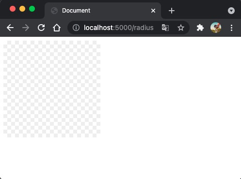

<div className={'img-desc'}>图：Nguyen Nhut</div>


## CSS对象
CSS.paintWorklet.addModule 是一个新方法，具体参见
[https://developer.mozilla.org/en-US/docs/Web/API/Worklet/addModule](https://developer.mozilla.org/en-US/docs/Web/API/Worklet/addModule)

### index.html
```html
<!DOCTYPE html>
<html lang="en">

<head>
  <meta charset="UTF-8">
  <meta http-equiv="X-UA-Compatible" content="IE=edge">
  <meta name="viewport" content="width=device-width, initial-scale=1.0">
  <title>Document</title>
  <style>
    .radius {
      width: 200px;
      height: 200px;
      background: paint(transparent-grid)
    }
  </style>
  <script>
    CSS.paintWorklet.addModule('jsbackground.js');
  </script>
</head>

<body>
  <div class="radius"></div>
</body>

</html>
```

### jsbackground.js
```js
// transparent-grid命名和CSS中的对应
registerPaint(
  "smooth-corners",
  class {
    paint(ctx, size) {
      ctx.strokeStyle = "black";
      ctx.lineWidth = 4;
      ctx.beginPath();
      ctx.arc(200, 200, 50, 0, 2 * Math.PI);
      ctx.stroke();
      ctx.closePath();
    }
  }
);

registerPaint(
  "transparent-grid",
  class {
    paint(context, size) {
      // 两个格子颜色
      var color1 = "#fff",
        color2 = "#eee";
      // 格子尺寸
      var units = 8;
      // 横轴数轴循环遍历下
      for (var x = 0; x < size.width; x += units) {
        for (var y = 0; y < size.height; y += units) {
          context.fillStyle = (x + y) % (units * 2) === 0 ? color1 : color2;
          context.fillRect(x, y, units, units);
        }
      }
    }
  }
);

```
### 效果
 

svg矢量图，可以用来做图片编辑时的背景