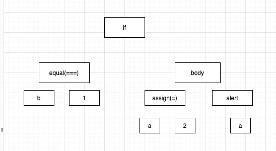

<div className={"img-desc"}>图：Mako Tsereteli</div>

## 简介

AST（Abstract Syntax Tree，抽象语法树）在 [Wikipedia](https://link.zhihu.com/?target=https%3A//en.wikipedia.org/wiki/Abstract_syntax_tree) 的定义如下：

> In computer science, an abstract syntax tree (AST), or just syntax tree, is a tree representation of the abstract syntactic structure of source code written in a programming language.

指的是：源代码的抽象语法结构的树状表现形式

## 编译原理

先回顾下编译原理的几大过程：

```
**词法分析**   ===>   单词与记号、正则表达式、有限自动机、从正则表达式到有限自动机的转换、词法分析器的实现
        ││
    **语法分析**   ===>   上下文无关文法、递归下降分析、LR 分析、错误处理、语法分析器自动生成
        ││
    **语义分析**   ===>   类型系统、属性文法、语法制导翻译、符号表管理、抽象语法树、线性中间表示、图中间表示
        ││
  **中间代码生成**   ===>   变量地址分配、算术表达式翻译、布尔表达式翻译、数组、结构体和字符串的翻译、控制流的翻译、函数调用的翻译
        ││
**目标代码优化与生成**   ===>   目标体系结构、树匹配代码生成、基于动态规划的代码生成、寄存器分配、指令调度、控制流分析、数据流分析、死代码删除、常量传播、拷贝传播、静态单赋值形式
```

JavaScript 是一门解释型语言，但其在执行过程中仍然需要即时编译（JIT），其编译过程也遵循这些流程：

```
**分词／词法分析**   ===>   把字符串分解成有意义的代码块，这些代码块被称为词法单元
      ││
**解析／语法分析**   ===>   词法单元流（数组）转换成一个由元素逐级嵌套所组成的代表了程序语法结构的树，即 AST
      ││
  **代码生成**   ===>   将 AST 转换为可执行代码
```

总结一下：通过 Parser 把代码转化为抽象语法树（AST），该树定义了代码的结构，通过对树的处理，能实现对代码的分析、优化等操作。

## JavaScript 词法解析

通过分析每行代码字符串，通过识别关键字来判断某句代码是什么表达式类型，然后把这些信息生成 AST 语法树

```js
if (b === 1) {
  a = 2;
  alert(a);
}
```

词法分析思维抽象如图

{" "}

## JavaScript 语法解析

在编译过程中，代码会被映射为 AST，那么就可以通过 AST 对代码进行分析、转换。像 webpack、babel、eslint 等涉及代码分析的工具类库，其背后都有 AST 的影子。

先看看 AST 长什么样，通过 [AST Explorer](https://astexplorer.net/) 或者[Parser](https://esprima.org/demo/parse.html)可以实时解析和查看 JavaScript 的 AST。

```js
const a = 1;
```

对应的 AST

```json
{
  "type": "Program",
  "body": [
    {
      "type": "VariableDeclaration",
      "declarations": [
        {
          "type": "VariableDeclarator",
          "id": {
            "type": "Identifier",
            "name": "a"
          },
          "init": {
            "type": "Literal",
            "value": 1,
            "raw": "1"
          }
        }
      ],
      "kind": "const"
    }
  ],
  "sourceType": "script"
}
```

AST 的格式每种 Parser 都有各自的标准，[Esprima](https://docs.esprima.org/en/4.0/syntax-tree-format.html) 的语法树结构文档 Syntax Tree Format，下面是 type 的类型列表。

```ts
type Expression =
  | ThisExpression
  | Identifier
  | Literal
  | ArrayExpression
  | ObjectExpression
  | FunctionExpression
  | ArrowFunctionExpression
  | ClassExpression
  | TaggedTemplateExpression
  | MemberExpression
  | Super
  | MetaProperty
  | NewExpression
  | CallExpression
  | UpdateExpression
  | AwaitExpression
  | UnaryExpression
  | BinaryExpression
  | LogicalExpression
  | ConditionalExpression
  | YieldExpression
  | AssignmentExpression
  | SequenceExpression;
```

## JavaScript Parser

介绍完 AST 树，下面列举常用的 JavaScript Parser

- [Esprima](https://link.zhihu.com/?target=http%3A//esprima.org/)
- [UglifyJS2](https://link.zhihu.com/?target=https%3A//github.com/mishoo/UglifyJS2)
- [Traceur](https://link.zhihu.com/?target=https%3A//github.com/google/traceur-compiler)
- [acorn](https://link.zhihu.com/?target=https%3A//github.com/acornjs/acorn)
- [espree eslint](https://link.zhihu.com/?target=https%3A//github.com/eslint/espree)
- [Shift](https://link.zhihu.com/?target=https%3A//github.com/shapesecurity/shift-parser-js)

各个 parser 的速度对比可以参见 Speed Comparison

## 应用

AST 的应用很广，从技术角度出发，所有涉及对代码处理的场景，AST 都有其用武之地。

编译器、代码压缩、代码混淆、代码优化，所有的 lint（不仅仅是 JavaScript），所有的打包构建工具及其插件，包括 webpack、rollup、parcel、browserify 等...

🍻