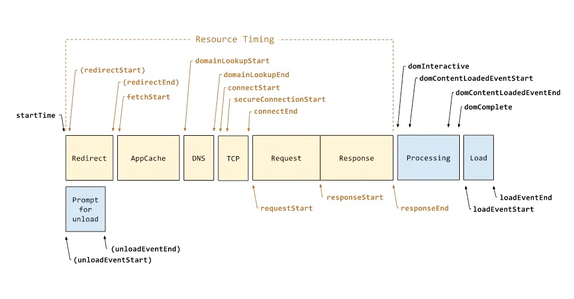
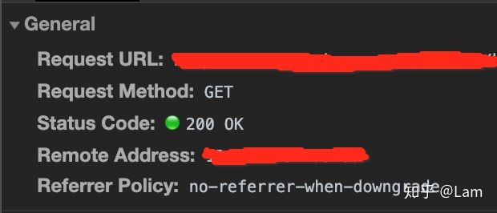
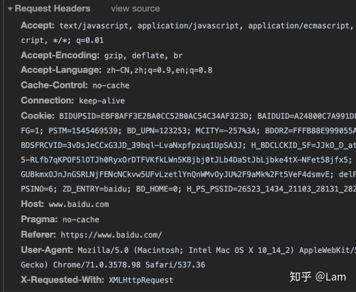
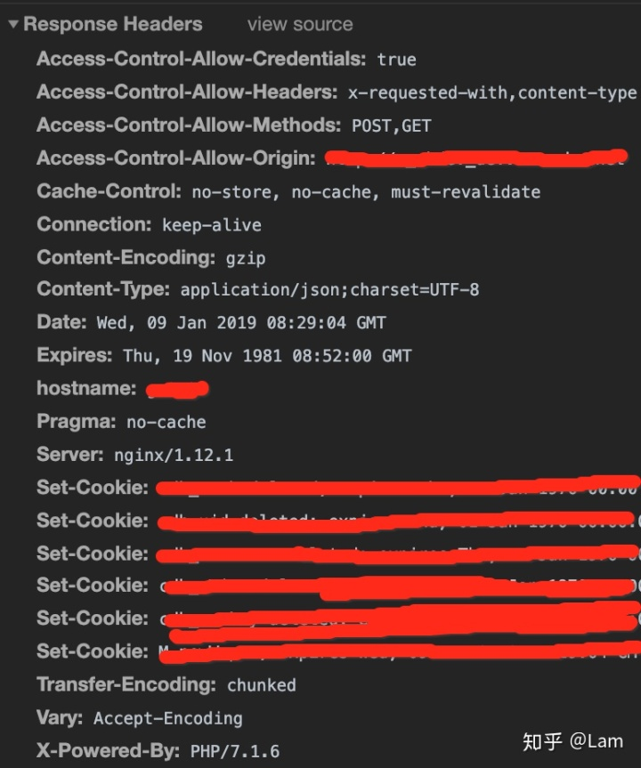

<div className={"img-desc"}>图：Amrit Pal Singh</div>

import Draw from "../../../../src/@narative/gatsby-theme-novela/components/draw";

## 前端页面生命周期



1、用户在浏览器中输入 url 地址

2、浏览器解析域名得到服务器 ip 地址

浏览器会首先从缓存中找是否存在域名，如果存在就直接取出对应的 ip 地址，如果没有就开启一个 DNS 域名解
析器。DNS 域名解析器会首先访问顶级域名服务器，将对应的 ip 发给客户端；然后访问根域名解析器，将对应的
ip 发给客户端；最后访问本地域名服务器，得到最终的 ip 地址。

3、TCP 三次握手建立客户端和服务器的连接

因为 HTTP 是基于 TCP 的可靠传输，所以在发送 http 数据报之前，需要先进行 TCP 的三次握手建立连接。三次
握手过程如下：

第一次握手：客户端--->服务端 ack=1,seq=x（x 随机生成）

第二次握手：服务端--->客户端 ACK=1,ack=x+1,seq=y（y 随机生成）

第三次握手：客户端--->服务端 ACK=1,ack=y+1,seq=x+1

完成第三次握手时，实际上客户端已经与服务器建立了连接，所以第三次握手的报文已经可以携带数据了。

4、客户端发送 HTTP 请求获取服务器端的静态资源

5、服务器发送 HTTP 响应报文给客户端，客户端获取到页面静态资源

6、TCP 四次挥手关闭客户端和服务器的连接

数据传输完毕后，TCP 会进行四次挥手断开连接，释放资源。四次挥手过程如下：

第一次挥手：客户端--->服务器 FIN=1,ack=1,seq=u 客户端状态变为 FIN_WAIT_1

第二次挥手：服务器--->客户端 ACK=1,ack=u+1,seq=v 服务器状态变为 CLOSE_WAIT，TCP 进入半关闭状态

第三次挥手：服务器--->客户端 FIN=1,ACK=1,ack=u+1,seq=w 服务器状态变为 LAST_ACK

第四次挥手：客户端--->服务器 ACK=1,ack=w+1,seq=u+1 客户端状态变为 TIME_WAIT，此时 TCP 未释放，需要等
待计时器计时完成后，客户端状态变为 CLOSED

7、浏览器解析文档资源并渲染页面

浏览器解析文档资源并渲染页面流程：

（1）解析 html 资源，构建 DOM Tree

（2）解析 css 资源，构建 CSS Rule Tree

（3）JS 通过 DOM API 和 CSS OM API 来操作 DOM Tree 和 CSS Tree

（4）解析完成后综合 DOM Tree 和 CSS Tree 会生成 Render Tree，计算每个元素的位置，这个过程就是回流
（layout or reflow）

（5）调用操作系统 Native GUI 的绘制

（6）页面绘制完成

## 网络模型

- OSI （理论）

模型武术忘传悔表赢

```
应用层
表示层
会话层
传输层
网络层
数据链路层
物理层
```

- TCP/IP （标准）

模型鼠王传音

```
应用层
传输层
网络层
数据链路层
```

## http 头部

http 协议主要组成部分：

状态行 - General 请求头 - Request Headers 响应头 - Respones Headers 状态行


在状态行中我们其实一般来说只需要关注Request Method和Status Code就可以了。

请求头


一般来说前端开发需要关注请求头数据大概如下：

Accept - 客户端喜欢接受的数据类型 Accept-Encoding - 一般我们需要看的值就是 gzip，一般我们的资源都会
进行 gzip Accept-Language - 客户端支持的语言，按顺序使用 Cache-Control - 浏览器请求资源的缓存设置
，no-cache 会比较常用，意思就是在使用缓存资源的时候必须先请求服务器进行验证 Pragme - 中间服务器不返
还资源标识，为兼容 http1.0 Connection - 开启持久链接，默认是 keep-alive(http1.1 才有哟) Cookie - 就
是将你浏览器中符合 cookie 的 path 中的 cookie 字段组成字符串提交给服务器 Referer - 页面来源，就是跳
转进当前页面的上一个页面路径 Content-Type - 告诉服务器提交的数据体是那种格式。响应头


响应头对于前端来说就十分重要了，无论是js或者css静态资源，或者是接口返回数据，里面的信息都十分重要。

Access-Control-Allow-Credentials - 跨域允许提交 cookie Access-Control-Allow-Methods - 跨域允许提交方
式 Access-Control-Allow-Origin - 跨域允许的域名路径（如果你的接口跨域可以检查一下这个哟，一般设置\*
即可） Cache-Control - http 缓存策略 Connection - 开启持久链接，默认是 keep-alive(http1.1 才有哟)
Content-Encoding - 一般我们需要看的值就是 gzip，一般我们的资源都会进行 gzip Content-Type - 告诉浏览
器以何种方式接收数据。 Set-Cookie - 服务器对浏览器设置 cookie 字段补充几个属性

Expires - 缓存到期时间 X-Cache - CDN 标识，有时候我们看 CDN 资源是否回源了，可以通过这个标识知道是否
命中到 CDN Content-Type 类型一般前端使用的 Content-Type 的类型有 3 种：

application/x-www-form-urlencoded - 默认方式，原生 ajax，jquery 都默认使用这种方式提交，该方式会将请
求的 json 数据格式序列化变成 key=value&key=value。 multipart/form-data - 这种方式一般是 form 表单提
交文件必须使用这种方式 application/json - 其实就是不进行序列化，直接以 JSON 方式提交，个人十分喜欢
content-type 属性在 request 头中是代表以何种数据格式进行提交，response 头中是代表浏览器需要以何种方
式接收数据以及解析数据。

keep-alive(TCP 链接持久化) 在 HTTP/1.0 里，为了实现 client 到 web-server 能支持长连接，必须在 HTTP
请求头里显示指定 Connection:keep-alive。

在 HTTP/1.1 里，就默认是开启了 keep-alive，要关闭 keep-alive 需要在 HTTP 请求头里显示指定
Connection:close。

如果不开启 keep-alive 的情况下，那么每一次请求都会重复 3 次握手，如果开启了的话，在一定时间内（这个
时间是服务器配置的）可以复用同一个 TCP。从而达到了性能的优化。

## 图像加载优化

图像延迟加载图片延时加载，是真实项目中的一个非常重要的性能优化手段。如果不做图片的延时加载，那也页面
渲染的时候，同时也要把图片资源请求回来，进行渲染，这样会阻碍页面的渲染进度，导致首次加载页面的速度很
慢，延迟加载一方面可以提要页面的加载速度，另一方面可以减少没必要的网络消耗

这里推荐使用 IntersectionObserver

```html
<!DOCTYPE html>
<html lang="en">
  <head>
    <meta charset="UTF-8" />
    <meta
      http-equiv="X-UA-Compatible"
      content="IE=edge"
    />
    <meta
      name="viewport"
      content="width=device-width, initial-scale=1.0"
    />
    <title>Document</title>
  </head>
  <style>
    * {
      margin: 0;
    }

    .imageLazyBox {
      width: 236px;
      height: 420px;
      background: url(./images/loading.gif) no-repeat center center #eee;
      background-size: 100px 100px;
      margin: 1000px 0px;
    }

    .imageLazyBox img {
      width: 100%;
      height: 100%;
      /* 开始图片隐藏：因为在ie 浏览器中，如果图片src 是空的，或者加载图片是错误的，图片不隐藏 ,会显示一个X 
        效果，很难看，所以图片没有加载之前还是让他隐藏比较好
        办法一: display:none;这种办法加载完成真实的图片后，还需让他display:blok;这样触发dom的回流重汇，性能消耗比较大
        办法二 ：opacity:0 ;transition:opacity: .3s; ->推荐方案，一方面加载真实图片后，我们只需要设置opacity:1;
        这样一方面不会引发dom的回流重汇，一方面可以css3实现出渐现的效果
        */
      opacity: 0;
      transition: opacity 1s;
      /* display: none; */
    }
  </style>
  <body>
    <div class="imageLazyBox">
      
    </div>
  </body>
</html>
<script>
  function imageLazyFun(imageLazyBox) {
    let imageItem = imageLazyBox.querySelector("img"),
      lazy_image = imageItem.getAttribute("lazy-image");
    imageItem.src = lazy_image;
    imageItem.onload = function () {
      imageItem.style.opacity = 1;
    };
    imageItem.removeAttribute("lazy-image");
    imageItem.isLoad = true;
  }

  let imageLazyBox = document.querySelector(".imageLazyBox");
  let ob = new IntersectionObserver((changes) => {
    // 我们监听的dom元素与可视窗口的交叉信息
    let item = changes[0];
    target = item.target;
    // 符合条件:盒子已经完全出现在视口中
    if (item.isIntersecting) {
      // 符合条件：盒子已经完全出现在视口中
      imageLazyFun(target);
      // 处理过一次延迟加载，以后这个元素出现无需要再次监听处理
      ob.unobserve(target);
    }
  });
  // 监听dom元素
  ob.observe(imageLazyBox);
  // 解除监听
  // ob.unobserve(imageLazyBox)
</script>
```

## 构建优化

并行构建（thread-loader、happypack）

构建缓存（cache-loader、hard-source-webpack-plugin）

代码切割（splitChunks）：按需加载，分离基础库和公共代码库。通过分割打包，可以将公共代码或外包依赖项
单独打包，并从客户端缓存中受益。在此过程中，整个的包体积没有变小，且需要执行的请求可能会变多，但缓存
的好处可以弥补这一成本。

Hash 缓存

减少构建（external、DllPlugin）

Tree Shaking

预渲染

分离样式：通过 css-loader、style-loader 等一系列 loader 打包好了的 css，如果是通过内联到 js 中，就会
存在 css 无法缓存、增加了 js 文件体积和未样式化元素闪动（FOUC）问题。

静态资源、图片内联： 使用 url-loader 内联资源，将小图像转换为 base64 形式的字符串，从而减少 http 请
求。

第三方库 external

第三方库按需加载

## 渲染优化

### 减少不必要的回流

js 处理 -> 计算样式 -> 页面布局 -> 绘制 -> 合成

- 渲染过程

1. 解析获取到的 HTML，生成 DOM 树，解析 CSS，生成 CSSOM 树

2. 将 DOM 树和 CSSOM 树进行结合，生成渲染树（render tree）

3.根据生成的渲染树，进行回流（Layout）,得到节点的几何信息（位置，大小）

4.重绘（Painting）：根据渲染树以及回流得到的几何信息，得到节点的绝对像素（像素，背景色，外观等）

5.Display 将像素发送给 GPU，展示在页面上。

- 回流

浏览器会把获取到的 HTML 代码解析成一个 DOM 树，html 中的每一个元素都是 DOM 树的一个节点，根节 点也就
是我们说的 document 对象。在渲染树中的一部分（或者全部）因为元素的规模尺寸、布局 、显隐等改 变而需要
重新构建，这就称为回流。每次页面至少会发生一次回流，就是在页面第一次渲染的时候。

- 何时发生回流?

添加或者删除可见的 DOM 元素元素的位置发生变化元素的尺寸发生变化（包括外边距、内边 距 、边框大小、高
度和宽度等）内容发生变化，文本或者图片被另一个不同尺寸的图片所代替页面开始渲染的 时 候浏览器的窗口尺
寸变化（回流是根据视口的大小来计算元素的位置和大小的）

- 重绘 在渲染树中的一些元素需要更新属性，而这些属性只是影响元素的外观、风格，不影响布局，就称为重绘
  。

- 什么时候发生重绘？

背景色改变样式发生改变的时候

- 区别

回流必定会引起重绘，重绘一定不会引起回流

回流会导致页面重排，影响性能

### 恰当的使用 web worker

由于设计原因，长期以来浏览器中 JS 都是单线程工作的，我们通过 EventLoop 驱动异步事件完成工作。然而随
着前端页面越来越复杂，有些应用不可避免的要在前端执行大量的计算，这种情况会较长一段时间占用主线程，用
户会感觉到明显的页面卡顿。在这种场景下我们可以使用 WebWorker 来解决问题。

```js
// main.js
const worker = new Worker("./worker.js");
worker.onmessage = (e) => {
  console.log(e.data);
};

worker.postMessage("hello worker");
```

```js
// worker.js
onmessage = (e) => {
  console.log(e.data);
  postMessage("hi from worker");
};
```

```js
// worker.js
self.onmessage = (e) => {
  console.log(e.data);
  self.postMessage("hi from worker");
};
```

### 将一个大任务拆分成多个微任务

```js
const taskList = splitTask(BigTask);

function processTaskList(taskStartTime) {
  let taskFinishTime;
  do {
    const nextTask = taskList.pop();
    processTask(nextTask);
    taskFinishTime = window.performance.now();
  } while (taskFinishTime - taskStartTime < 3);

  if (taskList.length > 0) {
    requestAnimationFrame(processTaskList);
  }
}

requestAnimationFrame(processTaskList);
```

## 缓存技术

### 强缓存

浏览器不会像服务器发送任何请求，直接从本地缓存中读取文件并返回 Status Code: 200 OK

200 form memory cache : 不访问服务器，一般已经加载过该资源且缓存在了内存当中，直接从内存中读取缓存。
浏览器关闭后，数据将不存在（资源被释放掉了），再次打开相同的页面时，不会出现 from memory cache。

200 from disk cache： 不访问服务器，已经在之前的某个时间加载过该资源，直接从硬盘中读取缓存，关闭浏览
器后，数据依然存在，此资源不会随着该页面的关闭而释放掉下次打开仍然会是 from disk cache。

优先访问 memory cache,其次是 disk cache，最后是请求网络资源

Expires：

过期时间，如果设置了时间，则浏览器会在设置的时间内直接读取缓存，不再请求 Cache-Control：当值设为
max-age=300 时，则代表在这个请求正确返回时间（浏览器也会记录下来）的 5 分钟内再次加载资源，就会命中
强缓存。 cache-control：除了该字段外，还有下面几个比较常用的设置值：

```
（1） max-age：用来设置资源（representations）可以被缓存多长时间，单位为秒；

（2） s-maxage：和
max-age 是一样的，不过它只针对代理服务器缓存而言；

（3）public：指示响应可被任何缓存区缓存；

（4）private：只能针对个人用户，而不能被代理服务器缓存；

（5）no-cache：强制客户端直接向服务器发送请
求,也就是说每次请求都必须向服务器发送。服务器接收到 请求，然后判断资源是否变更，是则返回新内容，否则
返回 304，未变更。这个很容易让人产生误解，使人误 以为是响应不被缓存。实际上 Cache-Control: no-cache

是会被缓存的，只不过每次在向客户端（浏览器）提供响应数据时，缓存都要向服务器评估缓存响应的有效性。

（6）no-store：禁止一切缓存（这个才是响应不被缓存的意思）。
```

cache-control

是 http1.1 的头字段，expires 是 http1.0 的头字段,如果 expires 和 cache-control 同时存

在，cache-control 会覆盖 expires，建议两个都写。

### 协商缓存

向服务器发送请求，服务器会根据这个请求的 request header 的一些参数来判断是否命中协商缓存，如果命中，
则返回 304 状态码并带上新的 response header 通知浏览器从缓存中读取资源；

Last-Modifed/If-Modified-Since 和 Etag/If-None-Match 是分别成对出现的，呈一一对应关系

- Etag/If-None-Match：

Etag：

Etag 是属于 HTTP 1.1 属性，它是由服务器（Apache 或者其他工具）生成返回给前端，用来帮助服务器控制 Web
端的缓存验证。 Apache 中，ETag 的值，默认是对文件的索引节（INode），大小（Size）和最后修改时间
（MTime）进行 Hash 后得到的。

If-None-Match:

当资源过期时，浏览器发现响应头里有 Etag,则再次像服务器请求时带上请求头 if-none-match(值是 Etag 的值
)。服务器收到请求进行比对，决定返回 200 或 304

- Last-Modifed/If-Modified-Since：

Last-Modified：

浏览器向服务器发送资源最后的修改时间

If-Modified-Since：

当资源过期时（浏览器判断 Cache-Control 标识的 max-age 过期），发现响应头具有 Last-Modified 声明，则
再次向服务器请求时带上头 if-modified-since，表示请求时间。服务器收到请求后发现有 if-modified-since
则与被请求资源的最后修改时间进行对比（Last-Modified）,若最后修改时间较新（大），说明资源又被改过，则
返回最新资源，HTTP 200 OK;若最后修改时间较旧（小），说明资源无新修改，响应 HTTP 304 走缓存。

Last-Modifed/If-Modified-Since 的时间精度是秒，而 Etag 可以更精确。

Etag 优先级是高于 Last-Modifed 的，所以服务器会优先验证 Etag

Last-Modifed/If-Modified-Since 是 http1.0 的头字段

## 性能检测

Performance 是 Chrome 浏览器自带的性能监测工具。根据我的使用，简单理解就是我们可以通过它录制一段时间
的浏览器活动，通过活动的数据去分析页面是否存在提升的空间。想要获取页面的活动数据，那我们的第一步便是
录制浏览器的活动。

具体做法可参考 https://www.cnblogs.com/mushanya/p/16827522.html
