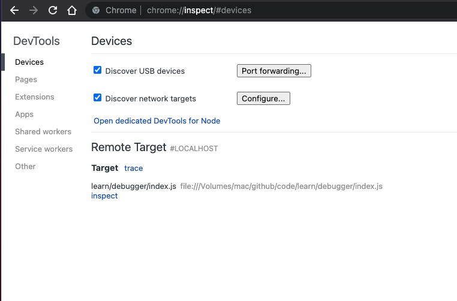
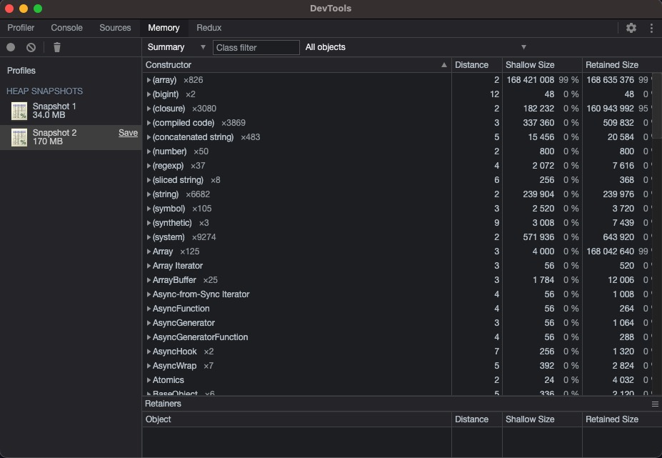

<div className={"img-desc"}>图：Nguyen Nhut</div>

## vscode 中 debug

### 可以使用 vscode 的 debug 工具


### 可以装 vscode 插件，code runner
右键run code

{" "}

## 浏览器原生 debug

```bash
node --inspect --inspect-brk xx/xx.js
```

浏览器输入 `chrome://inspect`

{" "}

memory 打快照查找内存泄露



## 内存泄露示例代码

```js
let index = 0;
let cache = {
  method: function () {
    debugger;
    console.log("this is cache", index);
  },
};

function cacheInfo(info) {
  index += 1;
  const prevCache = cache;

  const method = function () {
    if (prevCache) {
      prevCache.method();
    }
  };

  cache = {
    info: info,
    method() {
      method();
      console.log("this", index);
    },
  };
}

for (var i = 0; i < 100000; i++) {
  const info = new Array(1000000);
  cacheInfo(info);
  debugger;
}
```
