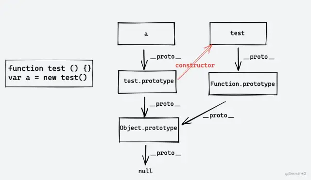

<div className={'img-desc'}>图：Nguyen Nhut</div>

import Draw from "../../../../src/@narative/gatsby-theme-novela/components/draw";

## 原型+原型链




* `prototype`是函数特有的属性，`__proto__`是每个对象都有的属性，而`prototype`本身也是一个对象

* 当我们去获取`a.name`的时候，会先从对象的自身属性开始查找，如果没有的话，就会从`a.__proto__`上找

* 对象`a.__proto__`又指向构造器函数`test`的`prototype`（原型），所以从`a.__proto`上找属性其实就是在`test.prototype`找属性，但是`prototype`（原型）本身又是一个对象，
这样的话，会重复上面两个步骤，最终都是找到了`Object`这个构造器函数，而`Object.__proto`是一个 `null` 值，如果中间有值就返回，没有就赋值`undefined`。

这样的链式结构就是原型链


因为构造器函数原型上的constructor是指向构造器函数自身的，所以

```js
a.constructor === test; // true
a.__proto__ === test.prototype  //true
a.__proto__.constructor === test; // true
a.__proto__.constructor === test.prototype.constructor; // true
test.prototype.constructor === test  //true
// 函数（包括原生构造函数）的原型对象为Function.prototype 
test.__proto__ === Function.prototype // true
```
函数都是由 Function 原生构造函数创建的，所以函数的 __proto__ 属性指向 Function 的 prototype 属性。

## 测试

```js
function test() {}
test.prototype.then = function () {
  console.log("test => then");
};
Function.prototype.mythen = function () {
  console.log("Function => mythen");
};
test.mythen();
test.then();
```

