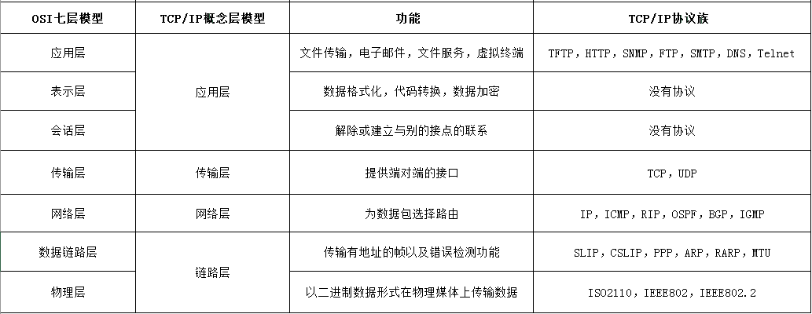

图：Kashish Arora

## TCP/IP网络协议
传输控制协议（TCP，Transmission Control Protocol）是一种面向连接的、可靠的、基于字节流的传输层通信协议 

IP是Internet Protocol（网际互连协议）的缩写，是TCP/IP体系中的网际层协议。

### OSI七层模型
OSI（开放系统互联(Open System Interconnection)）一般指开放式系统互联 

开放式系统互联是把网络通信的工作分为7层,分别是物理层,数据链路层,网络层,传输层,会话层,表示层和应用层。

第七层： 应用层 为操作系统或者网络应用程序提供访问网络服务的接口。 

第六层： 表示层 压缩，格式转换 

第五层： 会话层 负责数据传输中维持网络设备之间的通信链接 

第四层： 传输层 把传输表头加到数据上形成数据包，完成端到端的数据传输。协议：TCP UDP 

第三层： 网络层 负责对子网间的数据包进行寻址和路由选择,可以实现拥塞控制、网际互联等功能。协议：IP; (路由器)  

第二层： 数据链路层 物理地址寻址 （交换机/猫） 

第一层： 物理层 在局域网上进行数据传输，负责电脑通信设备与网络媒体之间的互通 (网线网卡……)

 
