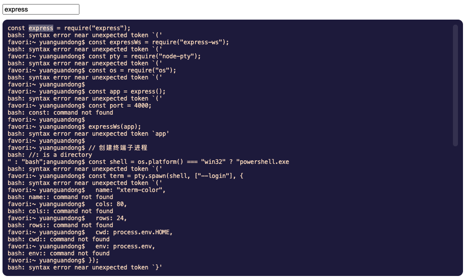

<div className={"img-desc"}>图：Tobias</div>

import Draw from "../../../../src/@narative/gatsby-theme-novela/components/draw";

最近公司项目要用到 web termianl, 先提前在家里做一个 🐶

## 效果图


自适应容器、带搜索、主题美化

## 准备

需求是自动化测试的日志，要实时的展现在前端，所以少不了 webSocket

在前端需要有个终端能显示出来，也有可能后续会需要在前端直接操作服务端的终端

所以，一次性到位，直接做个 web termianl

用到的库有 xterm、ahooks 等

具体过程写在代码注释里，一看就懂

上代码 👇

## 客户端

```tsx
import { useEffect, useLayoutEffect, useRef } from "react";
import { Terminal } from "xterm";
import { AttachAddon } from "xterm-addon-attach";
import { FitAddon } from "xterm-addon-fit";
import { SearchAddon } from "xterm-addon-search";
import { WebLinksAddon } from "xterm-addon-web-links";
import { AdventureTime } from "xterm-theme";
import { useSize, useWebSocket } from "ahooks";
import "xterm/css/xterm.css";
import "./index.less";

const socketURL = "ws://127.0.0.1:4000/socket";
const height = 500;
const fontSize = 12;

export default function HomePage() {
  const termRef = useRef<any>(null);
  const containerRef = useRef<any>(null);
  const insDomRef = useRef<any>(null);
  // 监听容器尺寸，用于做自适应
  const size = useSize(containerRef);

  // 直接使用封装好的useWebSocket
  const {
    readyState,
    sendMessage,
    latestMessage,
    disconnect,
    connect,
    webSocketIns,
  } = useWebSocket(socketURL);

  useEffect(() => {
    if (!webSocketIns) {
      return;
    }

    // 创建终端实例
    var term = new Terminal({
      fontFamily: 'Menlo, Monaco, "Courier New", monospace',
      fontWeight: 400,
      fontSize,
      theme: AdventureTime,
      rows: Math.floor(height / (fontSize + 2)),
    });

    // 添加终端插件
    // An addon for xterm.js that enables attaching to a web socket
    const attachAddon = new AttachAddon(webSocketIns as WebSocket);
    // 自适应容器插件
    const fitAddon = new FitAddon();
    // 搜索插件
    const searchAddon = new SearchAddon();
    // 超链接显示插件
    const webLinksAddon = new WebLinksAddon();

    term.loadAddon(attachAddon);
    term.loadAddon(fitAddon);
    term.loadAddon(searchAddon);
    term.loadAddon(webLinksAddon);

    // 把示例挂载给ref
    termRef.current = {
      term,
      searchAddon,
      fitAddon,
    };

    // render 终端到容器
    term.open(insDomRef.current);
    // 适用容器（发现只能适应宽度）
    fitAddon.fit();

    return () => {
      //组件卸载，清除 Terminal 实例
      term.dispose();
      termRef.current = null;
    };
  }, [webSocketIns]);

  // 响应容器尺寸副作用
  useLayoutEffect(() => {
    if (!size) {
      return;
    }
    // 想做响应式高度、不过这个方法调用报错说rows只能在构造函数里指定，暂时没想到好的办法处理
    // termRef.current.term.setOption(
    //   "rows",
    //   Math.floor(size.height / (fontSize + 2))
    // );
    termRef.current?.fitAddon?.fit();
  }, [size]);

  return (
    <>
      <input
        type="text"
        placeholder="查询关键字"
        onChange={(e) => termRef.current.searchAddon?.findNext(e.target.value)}
        style={{ marginBottom: 10 }}
      />
      <div style={{ height, width: "100%" }} ref={containerRef}>
        <div
          style={{
            background: "#1F1D45",
            borderRadius: 10,
            overflow: "hidden",
            padding: 10,
          }}
          ref={insDomRef}
        />
      </div>
    </>
  );
}
```
定制下滚动条，让其透明
```less
.xterm .xterm-viewport {
  &::-webkit-scrollbar {
    width: 10px;
    height: 10px;
  }

  &::-webkit-scrollbar-track {
    background-color: transparent;
    border-radius: 10px;
  }

  &::-webkit-scrollbar-thumb {
    background-color: rgba(255, 255, 255, 0.1);
    border-radius: 10px;
  }
}
```

## 服务端

```js
const express = require("express");
const expressWs = require("express-ws");
const pty = require("node-pty");
const os = require("os");
const example = require("./data");
const app = express();
const port = 4000;

expressWs(app);

// 创建终端子进程
const shell = os.platform() === "win32" ? "powershell.exe" : "bash";
const term = pty.spawn(shell, ["--login"], {
  name: "xterm-color",
  cols: 80,
  rows: 24,
  cwd: process.env.HOME,
  env: process.env,
});

// 暴露socket
app.ws("/socket", (ws, req) => {
  term.write(example);
  // 编码转换
  term.onData(function (data) {
    ws.send(data);
  });
  // 收到输入
  ws.on("message", (data) => {
    term.write(data);
  });
  ws.on("close", function () {
    term.kill();
  });
});

app.listen(port, "127.0.0.1", () => {
  console.log(`Example app listening on port ${port}`);
});
```
