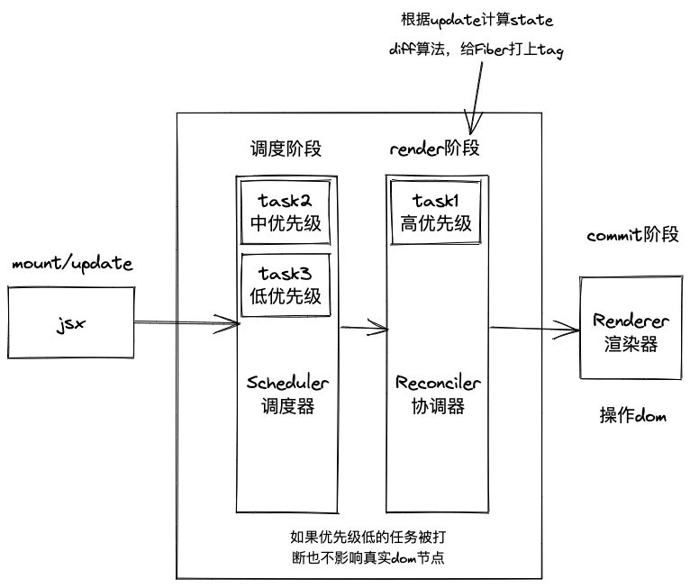
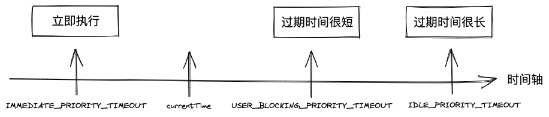
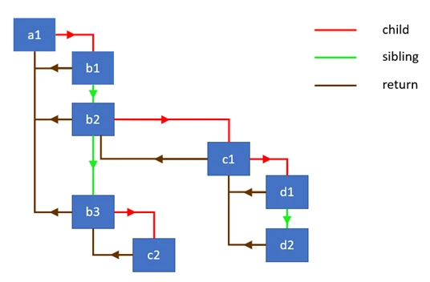
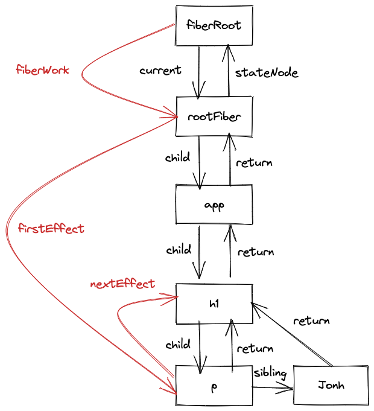

<div className={"img-desc"}>图：Mako Tsereteli</div>

## 总体

react 的核心可以用 ui=fn(state)来表示

```js
const state = reconcile(update);
const UI = commit(state);
```

- Scheduler（调度器）： 排序优先级，让优先级高的任务先进行 reconcile
- Reconciler（协调器）： 找出哪些节点发生了改变，并打上不同的 Flags（旧版本 react 叫 Tag）
- Renderer（渲染器）： 将 Reconciler 中打好标签的节点渲染到视图上



## Scheduler（调度器)

我们知道了要实现异步可中断的更新，需要浏览器指定一个时间，如果没有时间剩余了就需要暂停任务，requestIdleCallback 貌似是个不错的选择，但是它存在兼容和触发不稳定的原因，react17 中采用 MessageChannel 来实现。

在 Scheduler 中的每的每个任务的优先级使用过期时间表示的，如果一个任务的过期时间离现在很近，
说明它马上就要过期了，优先级很高，如果过期时间很长，那它的优先级就低，没有过期的任务存放在 timerQueue 中，
过期的任务存放在 taskQueue 中，timerQueue 和 timerQueue 都是小顶堆，
所以 peek 取出来的都是离现在时间最近也就是优先级最高的那个任务，然后优先执行它。

### 优先级
```js
var expirationTime = startTime + timeout;
```



### Lane模型
react之前的版本用expirationTime属性代表优先级，该优先级和IO不能很好的搭配工作（io的优先级高于cpu的优先级），现在有了更加细粒度的优先级表示方法Lane，Lane用二进制位表示优先级，二进制中的1表示位置，同一个二进制数可以有多个相同优先级的位，这就可以表示‘批’的概念，而且二进制方便计算。

这好比赛车比赛，在比赛开始的时候会分配一个赛道，比赛开始之后大家都会抢内圈的赛道（react中就是抢优先级高的Lane），比赛的尾声，最后一名赛车如果落后了很多，它也会跑到内圈的赛道，最后到达目的地（对应react中就是饥饿问题，低优先级的任务如果被高优先级的任务一直打断，到了它的过期时间，它也会变成高优先级）

Lane的二进制位如下，1的bits越多，优先级越低

```js
//ReactFiberLane.js
export const NoLanes: Lanes = /*                        */ 0b0000000000000000000000000000000;
export const NoLane: Lane = /*                          */ 0b0000000000000000000000000000000;

export const SyncLane: Lane = /*                        */ 0b0000000000000000000000000000001;
export const SyncBatchedLane: Lane = /*                 */ 0b0000000000000000000000000000010;

export const InputDiscreteHydrationLane: Lane = /*      */ 0b0000000000000000000000000000100;
const InputDiscreteLanes: Lanes = /*                    */ 0b0000000000000000000000000011000;

const InputContinuousHydrationLane: Lane = /*           */ 0b0000000000000000000000000100000;
const InputContinuousLanes: Lanes = /*                  */ 0b0000000000000000000000011000000;

export const DefaultHydrationLane: Lane = /*            */ 0b0000000000000000000000100000000;
export const DefaultLanes: Lanes = /*                   */ 0b0000000000000000000111000000000;

const TransitionHydrationLane: Lane = /*                */ 0b0000000000000000001000000000000;
const TransitionLanes: Lanes = /*                       */ 0b0000000001111111110000000000000;

const RetryLanes: Lanes = /*                            */ 0b0000011110000000000000000000000;

export const SomeRetryLane: Lanes = /*                  */ 0b0000010000000000000000000000000;

export const SelectiveHydrationLane: Lane = /*          */ 0b0000100000000000000000000000000;

const NonIdleLanes = /*                                 */ 0b0000111111111111111111111111111;

export const IdleHydrationLane: Lane = /*               */ 0b0001000000000000000000000000000;
const IdleLanes: Lanes = /*                             */ 0b0110000000000000000000000000000;

export const OffscreenLane: Lane = /*                   */ 0b1000000000000000000000000000000;
```


## Reconciler（协调器）

### Fiber 双缓存

Fiber 对象上面保存了包括这个节点的属性、类型、dom 等，Fiber 通过 child、sibling、return（指向父节点）来形成 Fiber 树

双缓存是指存在两颗 Fiber 树，current Fiber 树描述了当前呈现的 dom 树，workInProgress Fiber 是正在更新的 Fiber 树，这两颗 Fiber 树都是在内存中运行的，在 workInProgress Fiber 构建完成之后会将它作为 current Fiber 应用到 dom 上

Fiber 本质是环形链表结构，因为虚拟 dom 的结构还是树，所以一般称为 Fiber 树，遍历方式是深度优先遍历，child->sibling->return, 
child 和 sibling 都执行 beginWork, return 都执行 completeWork, 



遍历到每个节点，都会计算state, 对比节点差异，为节点赋值相应的effectFlags。

‘捕获’阶段发生在beginWork函数中，该函数做的主要工作是
* 创建Fiber节点，
* 计算state
* diff算法 

‘冒泡’阶段发生在completeWork中，
该函数主要是做一些收尾工作，例如
* 处理节点的props
* 形成一条effectList的链表 

该链表是被标记了更新的节点形成的链表,commit 阶段其实是拿这个 fiberEffectList 做更新

Reconciler会创建或者更新Fiber节点。在mount的时候会根据jsx生成Fiber对象，
在update的时候会根据最新的state形成的jsx对象和current Fiber树对比构建workInProgress Fiber树，
这个对比的过程就是diff算法。

在 mount 时（首次渲染），会根据 jsx 对象（Class Component 或的 render 函数者 Function Component 的返回值），构建 Fiber 对象，形成 Fiber 树，
然后这颗 Fiber 树会作为 current Fiber 应用到真实 dom 上，在 update（状态更新时如 setState）的时候，会根据状态变更后的 jsx 对象和 current Fiber 做对比形成新的 workInProgress Fiber，
然后 workInProgress Fiber 切换成 current Fiber 应用到真实 dom 就达到了更新的目的，而这一切都是在内存中发生的，从而减少了对 dom 好性能的操作。


### diff算法
diff算法发生在render阶段的reconcileChildFibers函数中，diff算法分为单节点的diff和多节点的diff（例如一个节点中包含多个子节点就属于多节点的diff），单节点会根据节点的key和type，props等来判断节点是复用还是直接新创建节点，多节点diff会涉及节点的增删和节点位置的变化

reconcile时会在这些Fiber上打上Flags标签，在commit阶段把这些标签应用到真实dom上，这些标签代表节点的增删改，如

```js
//ReactFiberFlags.js
export const Placement = /*             */ 0b0000000000010;
export const Update = /*                */ 0b0000000000100;
export const PlacementAndUpdate = /*    */ 0b0000000000110;
export const Deletion = /*              */ 0b0000000001000;
```

### updateQueue

Fiber 还保存了更新状态时用于计算 state 的 updateQueue，updateQueue 是一种链表结构，上面可能存在多个未计算的 update，update 也是一种数据结构，上面包含了更新的数据、优先级等，除了这些之外，上面还有和副作用有关的信息。


### effectList
effectList 生成方式示例如下：
```jsx
function App() {
  const [count, setCount] = useState(0);
  return (
   	 <>
      <h1
        onClick={() => {
          setCount(() => count + 1);
        }}
      >
        <p title={count}>{count}</p> John
      </h1>
    </>
  )
}
```
当点击h1时，会生成红色线条的effectList



## Renderer（渲染器）

Renderer发生在commit阶段，commit阶段遍历effectList执行对应的dom操作或部分生命周期。

Renderer是在commit阶段工作的，commit阶段会遍历render(reconciler)阶段形成的effectList，并执行真实dom节点的操作和一些生命周期，不同平台对应的Renderer不同，例如浏览器对应的就是react-dom。

commit阶段发生在commitRoot函数中，该函数主要遍历effectList，分别用三个函数来处理effectList上的节点，这三个函数是commitBeforeMutationEffects、commitMutationEffects、commitLayoutEffects


## concurrent

它是一类功能的合集（如fiber、schduler、lane、suspense），其目的是为了提高应用的响应速度，使应用cpu密集型的更新不在那么卡顿，其核心是实现了一套异步可中断、带优先级的更新。

我们知道一般浏览器的fps是60Hz，也就是每16.6ms会刷新一次，而js执行线程和GUI也就是浏览器的绘制是互斥的，因为js可以操作dom，影响最后呈现的结果，所以如果js执行的时间过长，会导致浏览器没时间绘制dom，造成卡顿。react17会在每一帧分配一个时间（时间片）给js执行，如果在这个时间内js还没执行完，那就要暂停它的执行，等下一帧继续执行，把执行权交回给浏览器去绘制。


## 最后
以上就是react的核心架构解析，详细的每个块的分析可以查阅其他文章 😬