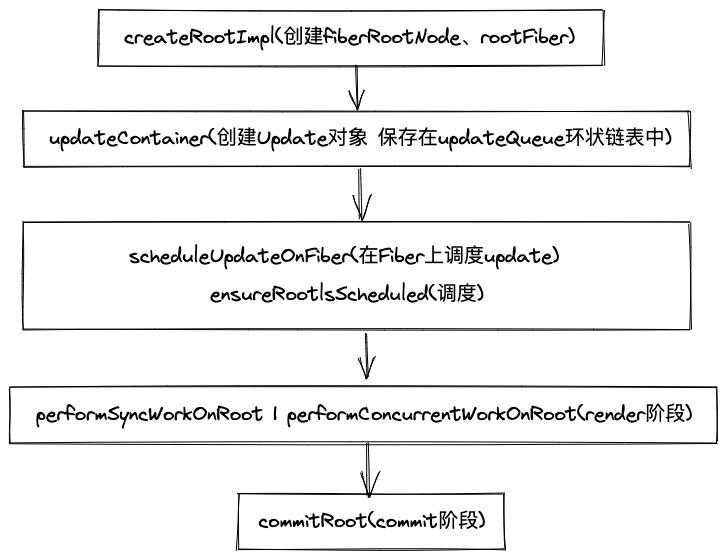

<div className={'img-desc'}>图：Nguyen Nhut</div>


## react启动的模式


react有3种模式进入主体函数的入口，我们可以从 react官方文档 使用 Concurrent 模式（实验性）中对比三种模式：

* legacy 模式： ReactDOM.render(<App />, rootNode)。这是当前 React app 使用的方式。当前没有计划删除本模式，但是这个模式可能不支持这些新功能。
* blocking 模式： ReactDOM.createBlockingRoot(rootNode).render(<App />)。目前正在实验中。作为迁移到 concurrent 模式的第一个步骤。
* concurrent 模式： ReactDOM.createRoot(rootNode).render(<App />)。目前在实验中，未来稳定之后，打算作为 React 的默认开发模式。这个模式开启了所有的新功能。


legacy 模式在合成事件中有自动批处理的功能，但仅限于一个浏览器任务。非 React 事件想使用这个功能必须使用 unstable_batchedUpdates。在 blocking 模式和 concurrent 模式下，所有的 setState 在默认情况下都是批处理的。会在开发中发出警告


## 不同模式在react运行时的含义
legacy模式是我们常用的，它构建dom的过程是同步的，所以在render的reconciler中，如果diff的过程特别耗时，那么导致的结果就是js一直阻塞高优先级的任务(例如用户的点击事件)，表现为页面的卡顿，无法响应。

concurrent Mode是react未来的模式，它用时间片调度实现了异步可中断的任务，根据设备性能的不同，时间片的长度也不一样，在每个时间片中，如果任务到了过期时间，就会主动让出线程给高优先级的任务。这部分将在第15节 scheduler&lane模型 。


## 两种模式函数主要执行过程

 

黄色部分是主要任务是创建fiberRootNode和rootFiber，红色部分是创建Update，蓝色部分是调度render阶段的入口函数


## legacy模式
render调用legacyRenderSubtreeIntoContainer，最后createRootImpl会调用到createFiberRoot创建fiberRootNode,然后调用createHostRootFiber创建rootFiber，其中fiberRootNode是整个项目的的根节点，rootFiber是当前应用挂在的节点，也就是ReactDOM.render调用后的根节点


```jsx

//最上层的节点是整个项目的根节点fiberRootNode
ReactDOM.render(<App />, document.getElementById("root"));//rootFiber
ReactDOM.render(<App />, document.getElementById("root"));//rootFiber

```

创建完Fiber节点后，legacyRenderSubtreeIntoContainer调用updateContainer创建创建Update对象挂载到updateQueue的环形链表上，然后执行scheduleUpdateOnFiber调用performSyncWorkOnRoot进入render阶段和commit阶段


## concurrent模式
createRoot调用createRootImpl创建fiberRootNode和rootNode
创建完Fiber节点后，调用ReactDOMRoot.prototype.render执行updateContainer，然后scheduleUpdateOnFiber异步调度performConcurrentWorkOnRoot进入render阶段和commit阶段


## 两种模式的不同点

1. createRootImpl中传入的第二个参数不一样 一个是LegacyRoot一个是ConcurrentRoot
2. requestUpdateLane中获取的lane的优先级不同
3. 在函数scheduleUpdateOnFiber中根据不同优先级进入不同分支，legacy模式进入performSyncWorkOnRoot，concurrent模式会异步调度performConcurrentWorkOnRoot


