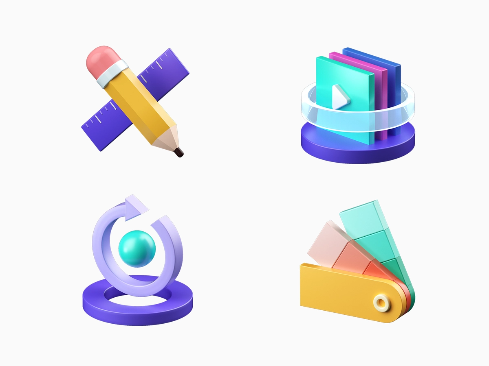

<div className={'img-desc'}>图：Vivivian</div>

import Draw from "../../../../components/draw";

## for循环

循环的使用是保持代码干燥和避免重复的好方法。与 Sass 不同，Less 中没有用于编写循环的内置`@for`或`@each`指令，但它仍然可以使用递归混合来编写。递归 mixin 只不过是一个不断调用自身的 mixin。

使用 Less 编写的循环有四个关键组件，它们如下所示：

* 带有保护表达式的 mixin。当满足循环的退出条件时，守卫用于终止循环。就 JavaScript for 循环 ( `for([initialization]; [condition]; [final-expression])`) 而言，守卫是`[condition]`.


* 对 mixin 的主要调用以执行第一次迭代。对 mixin 的主要调用可以在选择器块内进行（如果 mixin 没有选择器包装其所有内容）或从选择器块外部（如果 mixin 有选择器包装其内容）。就 JavaScript for 循环而言，此主要调用用作[initialization]设置类计数器变量的基值。

* 从内部调用 mixin 以使其递归。此调用通常将计数器变量的递增或递减值作为参数传递。因此它调用了后续的迭代。就 JS for 循环而言，这`[final-expression]`与下一个调用一起执行。

* 最后但并非最不重要的一点是，mixin 的其他内容等价statement于典型的 for 循环语法。


下面是一个用 Less 编写的简单 for 循环，它创建多个`#img*`选择器（其中 * 是一个数字）并将`background-image`属性设置为`image*.png`


```less
.for-loop(@index) when (@index > 0) { /* recursive mixin with guard expression - condition */

  /* the statement */
  #img@{index} {
    background-image: url("http://mysite.com/image@{index}.png");
  }
  /* end of the statement */

  .for-loop(@index - 1); /* the next iteration's call - final-expression*/
}
.for-loop(3); /* the primary call - initialization */
```

编译的CSS：

```css
#img3 {
  background-image: url("http://mysite.com/image3.png");
}
#img2 {
  background-image: url("http://mysite.com/image2.png");
}
#img1 {
  background-image: url("http://mysite.com/image1.png");
}
```

## forEach 循环
Less 中的 for-each 循环与 for 循环具有相同的关键组件，但有以下区别：

* 包含必须迭代的项目列表的变量。
* `extract()`基于循环索引提取变量中每个项目的函数。
* 一个`length()`计算数组长度的函数（即列表中的项目数）并在主 mixin 调用（`for [initialization]`）中使用它。
下面是一个用 `Less` 编写的 `for-each` 循环示例，它遍历`@images`变量中的每个项目，创建一个与项目/图像名称相同的`#id`选择器，并为其设置背景图像属性`id`


```less
@images: cat, dog, apple, orange; /* the array list of items */

.for-each-loop(@index) when (@index > 0) { /* recursive mixin call with guard - condition */
  
  @image: extract(@images, @index); /* extract function to fetch each item from the list */
  
 /* the statement */
  #@{image} {
    background-image: url("http://mysite.com/@{image}.png");
  }
  /* end of the statement */

  .for-each-loop(@index - 1); /* the next iteration's call - final-expression */
}

.for-loop(length(@images)); /* the primary call with length() function - initialization */
```

编译的CSS：

```css
#orange {
  background-image: url("http://mysite.com/orange.png");
}
#apple {
  background-image: url("http://mysite.com/apple.png");
}
#dog {
  background-image: url("http://mysite.com/dog.png");
}
#cat {
  background-image: url("http://mysite.com/cat.png");
}
```