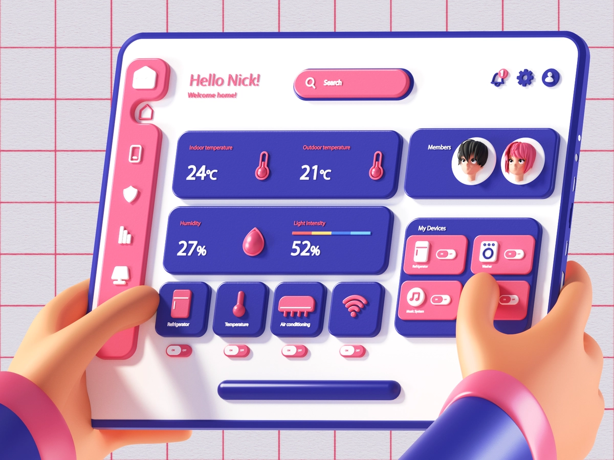


<div className={"img-desc"}>图：</div>

## 什么是微前端？

微前端就是将不同的功能按照不同的维度拆分成多个子应用, 通过主应用来加载这些子应用。

> @玉伯: 微前端的前提，还是得有主体应用，然后才有微组件或微应用，解决的是可控体系下的前端协同开发问题（含空间分离带来的协作和时间延续带来的升级维护）。

微前端的核心在于拆, 拆完后再合!

## 为什么要去使用微前端？

- 不同团队间开发同一个应用技术栈不同怎么破？
- 希望每个团队都可以独立开发，独立部署怎么破？
- 项目中还需要老的应用代码怎么破？

我们是不是可以将一个应用划分成若干个子应用，将子应用打包成一个个的 lib。当路径切换时加载同的子应用。这样每个子应用都是独立的，技术栈也不用做限制了！从而解决了前端协同开发问题

## 核心准则/微前端目标

- 技术栈无关
  主框架不限制接入应用的技术栈，微应用具备完全自主权
  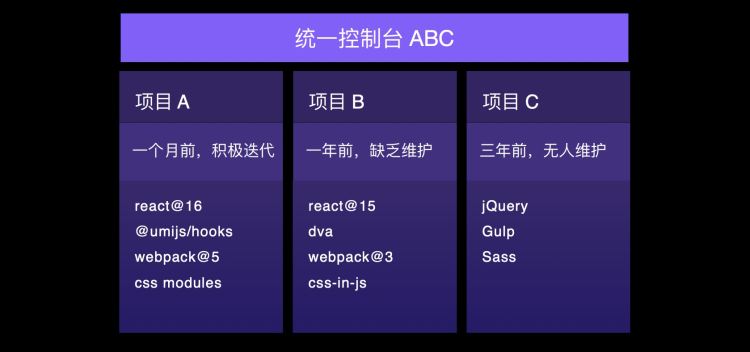
- 向前向后兼容
  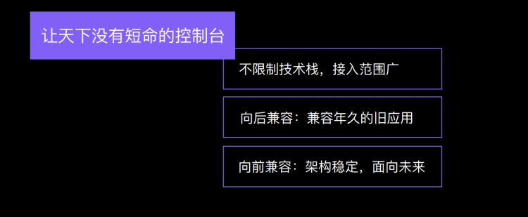
- 独立开发、独立部署
  微应用仓库独立，前后端可独立开发，部署完成后主框架自动完成同步更新
- 增量升级
  在面对各种复杂场景时，我们通常很难对一个已经存在的系统做全量的技术栈升级或重构，而微前端是一种非常好的实施渐进式重构的手段和策略
- 独立运行时
  每个微应用之间状态隔离，运行时状态不共享

## 核心原理

通过动态加载 html 分析其加载的 css 和 js, 然后动态加载其 js 和 css

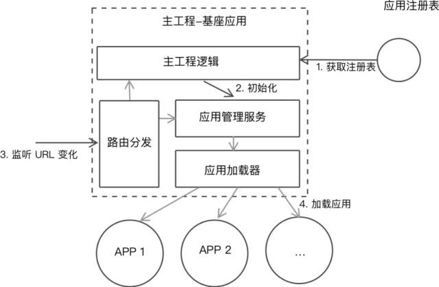

## 微前端的两种形态

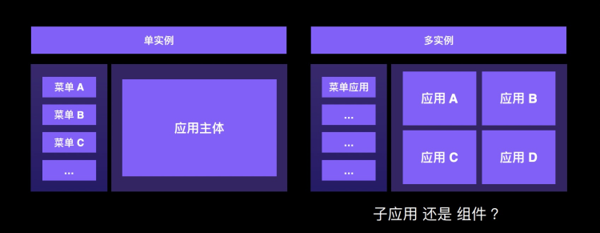{" "}

### 主应用结构

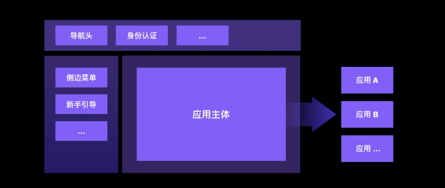

此 demo 展示最基本的原理，不是最终的方案实现

## 微前端框架⾯临的共性问题和解决方案

- JS 隔离
- CSS 隔离
- HTML entry
- 按需加载
- 预加载
- 父子应用通信
- 子应用并行
- 子应用嵌套
- 公共依赖

### 中心化

应用注册表。这个应用注册表拥有每个应用及对应的入口。在前端领域里，入口的直接表现形式可以是路由，又或者对应的应用映射。

### 标识化应用

我们需要一个标识符来标识不同的应用，以便于在安装、卸载的时候，能寻找到指定的应用。一个简单的模式，就是通过康威定律来命名应用。应用生命周期管理。高内聚，低耦合。

### 生命周期

微前端应用作为一个客户端应用，每个应用都拥有自己的生命周期：

```
Load，决定加载哪个应用，并绑定生命周期
bootstrap，获取静态资源
Mount，安装应用，如创建 DOM 节点
Unload，删除应用的生命周期
Unmount，卸载应用，如删除 DOM 节点、取消事件绑定
```

精简后

```
bootstrap
mount
onmount
```

### 两组问题

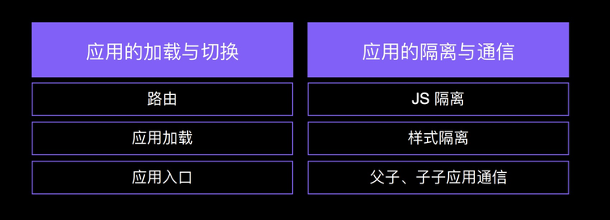

### 应用加载和切换

应⽤路由劫持和转发


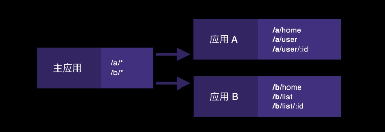

应⽤接⼊：协议接⼊


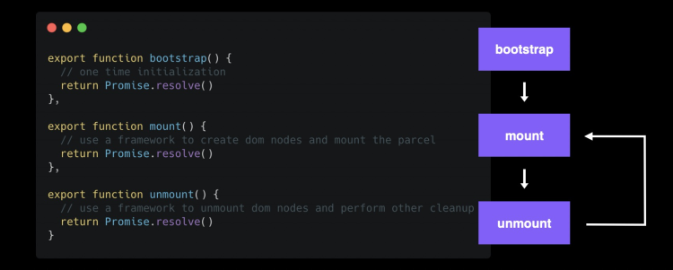
应用加载 App Entry
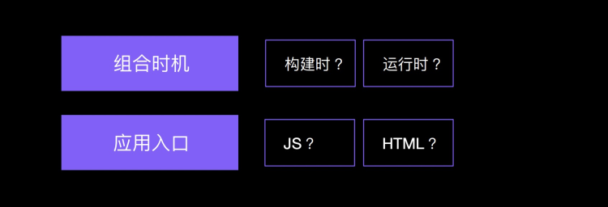
加载时机
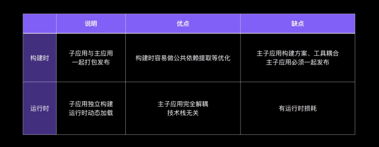
最优加载是运行时 HTML Entry
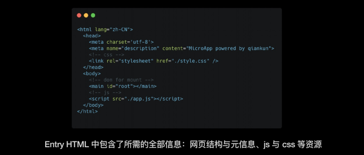

#### 应用的隔离和通信

JS 变量隔离、JS 沙箱


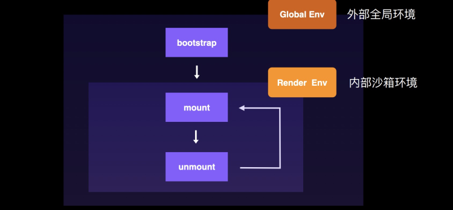 

快照沙箱
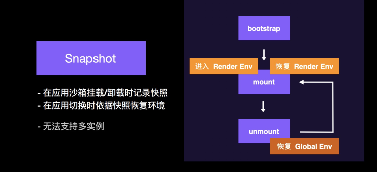 

代理沙箱
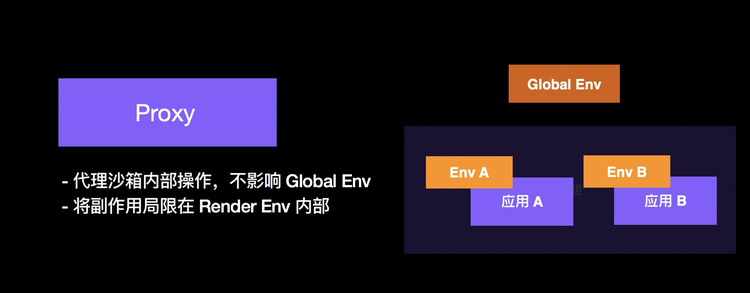 

样式隔离、CSS隔离
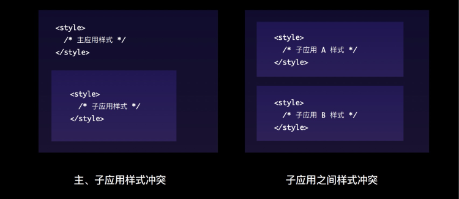 


子应用间的样式隔离


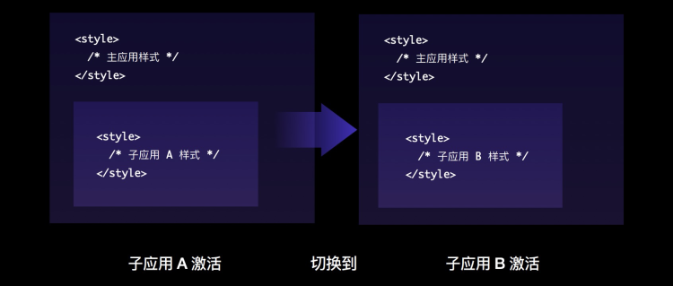 

父子应用样式隔离
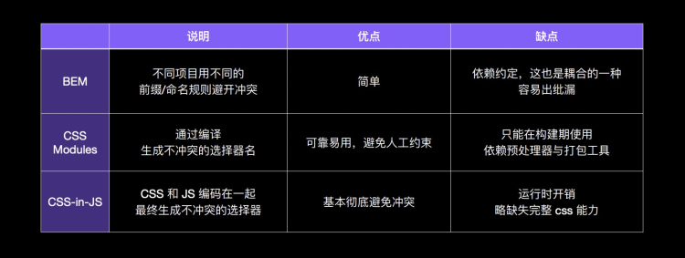 

影子DOM方案
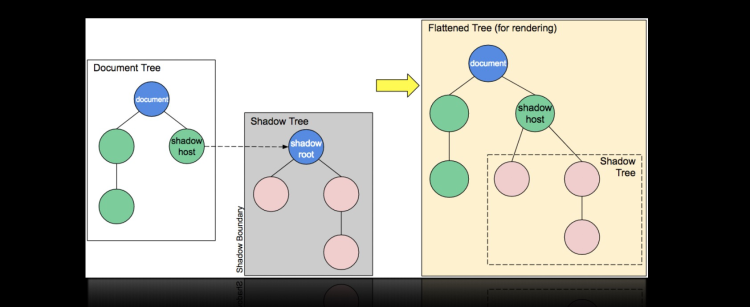 


#### 应用通信

基于路由

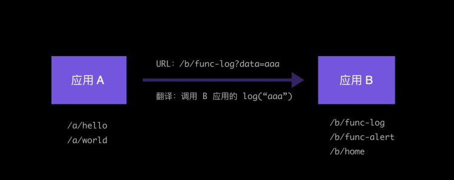 

基于事件总线
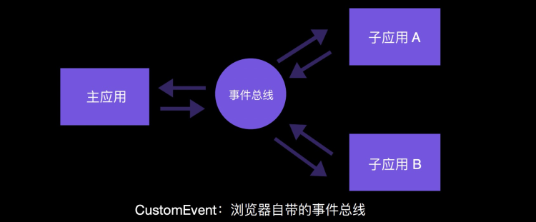 

基于状态传递 props、全局状态管理器 dva/redux
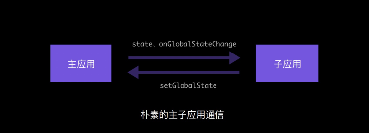 

通信方式总结
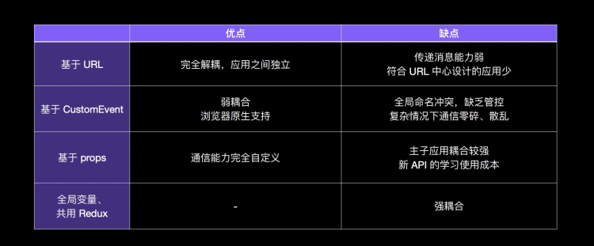 


## FAQ
### 为什么不是 iFrame?
[为什么](https://www.yuque.com/kuitos/gky7yw/gesexv)

### 组件/widget 与微应用的区别?
独立开发独立部署的——微应用 

不是独立开发独立部署的——组件/widget 

组件/widget 和 微应用可以按具体业务需求进行提升/转化

