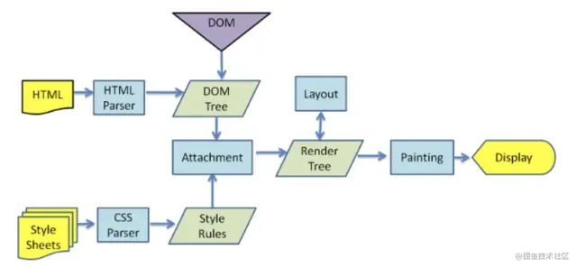

<div className={'img-desc'}>图：Nguyen Nhut</div>


## get 和 post 有什么区别？

1. 形式
2. 安全性
3. 大小
4. 编码方式
5. 缓存

## http1.0和http1.1和http2.0区别

http1.1
1. 持久链接
2. 管道机制
3. 新方法，PUT,DELETE,OPTIONS,PATCH
4. 新增缓存字段
5. 断点续传，通过Range字段来实现

http2.0
1. 多路复用
2. 头部压缩
3. 二进制传输
4. 优先级
5. 服务器可以主动推送消息


## 200 状态码一定是服务器返回的吗？
不是，命中强缓存的话，会直接从内存或者磁盘中读取资源，并返回一个 200 状态码

## generate自动执行
```js
function asyncToGenerator(generatorFunc) {
  return function () {
    const genFn = generatorFunc.apply(this, arguments);
    const next = (data) => {
      const { value, done } = genFn.next(data);
      if (done) return;
      value.then((data) => {
        next(data);
      });
    };
    next(arguments);
  };
}
```

## 从输入一个 URL 地址到浏览器完成渲染的整个过程

1. 浏览器地址栏输入 URL 并回车
2. 浏览器查找当前 URL 是否存在缓存，并比较缓存是否过期
3. DNS 解析 URL 对应的 IP
4. 根据 IP 建立 TCP 连接（三次握手）
5. 发送 http 请求
6. 服务器处理请求，浏览器接受 HTTP 响应
7. 浏览器解析并渲染页面
8. 关闭 TCP 连接（四次握手）

其中浏览器渲染过程如下



## 将虚拟 Dom 转化为真实 Dom
```js
{
  tag: 'DIV',
  attrs:{
  id:'app'
  },
  children: [
    {
      tag: 'SPAN',
      children: [
        { tag: 'A', children: [] }
      ]
    },
    {
      tag: 'SPAN',
      children: [
        { tag: 'A', children: [] },
        { tag: 'A', children: [] }
      ]
    }
  ]
}
//把上诉虚拟Dom转化成下方真实Dom
<div id="app">
  <span>
    <a></a>
  </span>
  <span>
    <a></a>
    <a></a>
  </span>
</div>
```

```js
// 真正的渲染函数
function _render(vnode) {
  // 如果是数字类型转化为字符串
  if (typeof vnode === "number") {
    vnode = String(vnode);
  }
  // 字符串类型直接就是文本节点
  if (typeof vnode === "string") {
    return document.createTextNode(vnode);
  }
  // 普通DOM
  const dom = document.createElement(vnode.tag);
  if (vnode.attrs) {
    // 遍历属性
    Object.keys(vnode.attrs).forEach((key) => {
      const value = vnode.attrs[key];
      dom.setAttribute(key, value);
    });
  }
  // 子数组进行递归操作 这一步是关键
  vnode.children.forEach((child) => dom.appendChild(_render(child)));
  return dom;
}
```

## babel工作原理

Babel 的三个主要处理步骤分别是： 解析（parse），转换（transform），生成（generate）。


* 解析
将代码解析成抽象语法树（AST），每个 js 引擎（比如 Chrome 浏览器中的 V8 引擎）都有自己的 AST 解析器，而 Babel 是通过 Babylon 实现的。在解析过程中有两个阶段：词法分析和语法分析，词法分析阶段把字符串形式的代码转换为令牌（tokens）流，令牌类似于 AST 中节点；而语法分析阶段则会把一个令牌流转换成 AST 的形式，同时这个阶段会把令牌中的信息转换成 AST 的表述结构。


* 转换
在这个阶段，Babel 接受得到 AST 并通过 babel-traverse 对其进行深度优先遍历，在此过程中对节点进行添加、更新及移除操作。这部分也是 Babel 插件介入工作的部分。


* 生成
将经过转换的 AST 通过 babel-generator 再转换成 js 代码，过程就是深度优先遍历整个 AST，然后构建可以表示转换后代码的字符串。


## RAF 和 RIC 是什么
requestAnimationFrame： 告诉浏览器在下次重绘之前执行传入的回调函数(通常是操纵 dom，更新动画的函数)；由于是每帧执行一次，那结果就是每秒的执行次数与浏览器屏幕刷新次数一样，通常是每秒 60 次。

requestIdleCallback：: 会在浏览器空闲时间执行回调，也就是允许开发人员在主事件循环中执行低优先级任务，而不影响一些延迟关键事件。如果有多个回调，会按照先进先出原则执行，但是当传入了 timeout，为了避免超时，有可能会打乱这个顺序。
