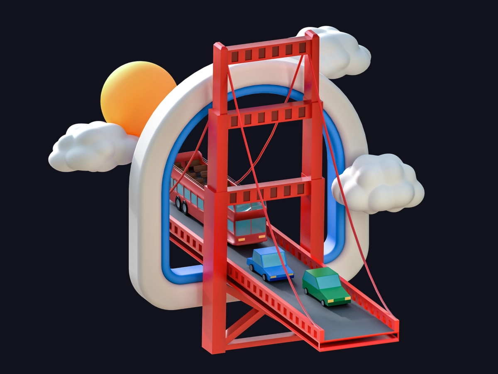
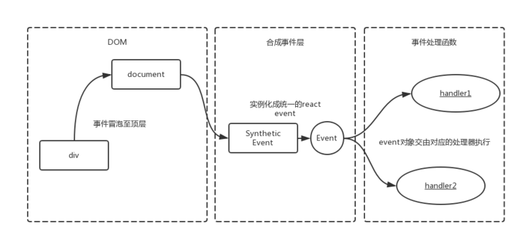
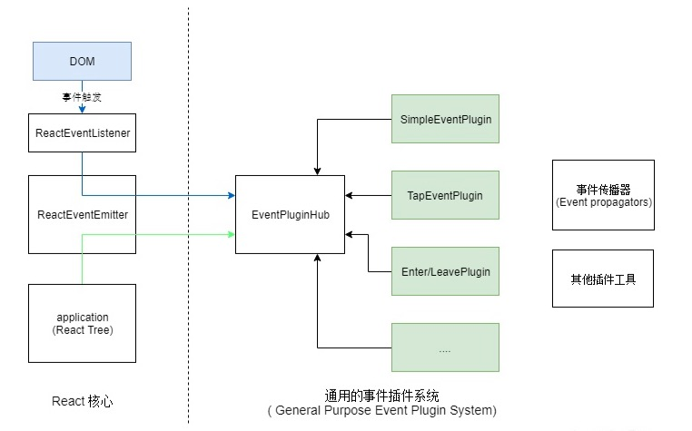

<div className={"img-desc"}>图：Amrit Pal Singh</div>

import Draw from "../../../../components/draw";

React 并不会在该 DOM 元素上直接绑定事件处理器. React 内部自定义了一套事件系统，在这个系统上统一进行事件订阅和分发.

具体来讲，React 利用事件委托机制在 Document(17 是 rootFiber) 上统一监听 DOM 事件，再根据触发的 target 将事件分发到具体的组件实例。另外上面 e 是一个合成事件对象(SyntheticEvent), 而不是原始的 DOM 事件对象.

## 原理

从实现上讲, 主要分为 3 步:

1. 监听原生事件: 对齐 DOM 元素和 fiber 元素
2. 收集 listeners: 遍历 fiber 树, 收集所有监听本事件的 listener 函数.
3. 派发合成事件: 构造合成事件, 遍历 listeners 进行派发.

## 动机

1. 抹平浏览器之间的兼容性差异。
2. 抽象跨平台事件机制
3. React 打算做更多优化
4. React 打算干预事件的分发

## 事件代理

1. 区别于浏览器事件处理方式，React 并未将事件处理函数与对应的 DOM 节点直接关联，而是在顶层使用
   了一个全局事件监听器监听所有的事件；
2. React 会在内部维护一个映射表记录事件与组件事件处理函数的对应关系；
3. 当某个事件触发时，React 根据这个内部映射表将事件分派给指定的事件处理函数；
4. 当映射表中没有事件处理函数时，React 不做任何操作；
5. 当一个组件安装或者卸载时，相应的事件处理函数会自动被添加到事件监听器的内部映射表中或从表中删除。

## 合成事件

与浏览器事件处理稍微有不同的是，React 中的事件处理程序所接收的事件参数是被称为“合成事件（SyntheticEvent）”的实例。

1. 合成事件是对浏览器原生事件跨浏览器的封装，并与浏览器原生事件有着同样的接口，如 stopPropagation(),preventDefault()等，并且
   这些接口是跨浏览器兼容的。
2. 如果需要使用浏览器原生事件，可以通过合成事件的 nativeEvent 属性获取
3. React 合成事件原理

使用 JSX，在 React 中绑定事件：

```jsx
<button onClick={this.onClick}>单击触发react事件</button>
```

React 并不是将 click 事件绑在该 div 的真实 DOM 上，而是在 document 处监听所有支持的事件，当事件发生并冒泡至 document 处时，React 将事件内容封装并交由真正的处理函数运行



## 基本概念



- ReactEventListener - 事件处理器. 在这里进行事件处理器的绑定。当 DOM 触发事件时，会从这里开始调度分发到 React 组件树
- ReactEventEmitter - 暴露接口给 React 组件层用于添加事件订阅
- EventPluginHub - 如其名，这是一个‘插件插槽’，负责管理和注册各种插件。在事件分发时，调用插件来生成合成事件
- Plugin - React 事件系统使用了插件机制来管理不同行为的事件。这些插件会处理自己感兴趣的事件类型，并生成合成事件对象。目前 ReactDOM 有以下几种插件类型:
- SimpleEventPlugin - 简单事件, 处理一些比较通用的事件类型，例如 click、input、keyDown、mouseOver、mouseOut、pointerOver、pointerOut

- EventPropagators 按照 DOM 事件传播的两个阶段，遍历 React 组件树，并收集所有组件的事件处理器.
- EventBatching 负责批量执行事件队列和事件处理器，处理事件冒泡。
- SyntheticEvent 这是‘合成’事件的基类，可以对应 DOM 的 Event 对象。只不过 React 为了减低内存损耗和垃圾回收，使用一个对象池来构建和释放事件对象， 也就是说 SyntheticEvent 不能用于异步引用，它在同步执行完事件处理器后就会被释放。

## 事件分类与优先级

SimpleEventPlugin 将事件类型划分成了三类, 对应不同的优先级(优先级由低到高):

- DiscreteEvent 离散事件. 例如 blur、focus、 click、 submit、 touchStart. 这些事件都是离散触发的
- UserBlockingEvent 用户阻塞事件. 例如 touchMove、mouseMove、scroll、drag、dragOver 等等。这些事件会'阻塞'用户的交互。
- ContinuousEvent 可连续事件。例如 load、error、loadStart、abort、animationEnd. 这个优先级最高，也就是说它们应该是立即同步执行的，这就是 Continuous 的意义，即可连续的执行，不被打断.

## React 有 5 个优先级级别:

- Immediate - 这个优先级的任务会同步执行, 或者说要马上执行且不能中断
- UserBlocking(250ms timeout) 这些任务一般是用户交互的结果, 需要即时得到反馈 .
- Normal (5s timeout) 应对哪些不需要立即感受到的任务，例如网络请求
- Low (10s timeout) 这些任务可以放后，但是最终应该得到执行. 例如分析通知
- Idle (no timeout) 一些没有必要做的任务 (e.g. 比如隐藏的内容).

## 如何绑定

1. 在 props 初始化和更新时会进行事件绑定。首先 React 会判断元素是否是媒体类型，媒体类型的事件是无法在 Document 监听的，所以会直接在元素上进行绑定
2. 反之就在 rootFiber 上绑定. 这里面需要两个信息，一个就是上文提到的'事件依赖列表', 比如 onMouseEnter 依赖 mouseover/mouseout; 第二个是 ReactBrowserEventEmitter 维护的'已订阅事件表'。事件处理器只需在 Document 订阅一次，所以相比在每个元素上订阅事件会节省很多资源.

```tsx
export function listenTo(
  registrationName: string, // 注册名称，如onClick
  mountAt: Document | Element | Node // 组件树容器，一般是Document
): void {
  const listeningSet = getListeningSetForElement(mountAt); // 已订阅事件表
  const dependencies = registrationNameDependencies[registrationName]; // 事件依赖

  for (let i = 0; i < dependencies.length; i++) {
    const dependency = dependencies[i];
    if (!listeningSet.has(dependency)) {
      // 未订阅
      switch (dependency) {
        // ... 特殊的事件监听处理
        default:
          const isMediaEvent = mediaEventTypes.indexOf(dependency) !== -1;
          if (!isMediaEvent) {
            trapBubbledEvent(dependency, mountAt); // 设置事件处理器
          }
          break;
      }
      listeningSet.add(dependency); // 更新已订阅表
    }
  }
}
```

## 如何触发

不同的事件类型有不同的事件处理器, 它们的区别是调度的优先级不一样:

```jsx
// 离散事件
// discrentUpdates 在UserBlocking优先级中执行
function dispatchDiscreteEvent(topLevelType, eventSystemFlags, nativeEvent) {
  flushDiscreteUpdatesIfNeeded(nativeEvent.timeStamp);
  discreteUpdates(dispatchEvent, topLevelType, eventSystemFlags, nativeEvent);
}

// 阻塞事件
function dispatchUserBlockingUpdate(
  topLevelType,
  eventSystemFlags,
  nativeEvent
) {
  // 如果开启了enableUserBlockingEvents, 则在UserBlocking优先级中调度，
  // 开启enableUserBlockingEvents可以防止饥饿问题，因为阻塞事件中有scroll、mouseMove这类频繁触发的事件
  // 否则同步执行
  if (enableUserBlockingEvents) {
    runWithPriority(
      UserBlockingPriority,
      dispatchEvent.bind(null, topLevelType, eventSystemFlags, nativeEvent)
    );
  } else {
    dispatchEvent(topLevelType, eventSystemFlags, nativeEvent);
  }
}

// 可连续事件则直接同步调用dispatchEvent
```

最终都会调用 dispatchEvent 函数. dispatchEvent 中会从 DOM 原生事件对象获取事件触发的 target，再根据这个 target 获取关联的 React 节点实例.

## 插件是如何处理事件

SimpleEventPlugin

```js
const SimpleEventPlugin: PluginModule<MouseEvent> & {
  getEventPriority: (topLevelType: TopLevelType) => EventPriority,
} = {
  eventTypes: eventTypes,
  // 抽取事件对象
  extractEvents: function (
    topLevelType: TopLevelType,
    targetInst: null | Fiber,
    nativeEvent: MouseEvent,
    nativeEventTarget: EventTarget
  ): null | ReactSyntheticEvent {
    // 事件配置
    const dispatchConfig = topLevelEventsToDispatchConfig[topLevelType];

    // 1️⃣ 根据事件类型获取SyntheticEvent子类事件构造器
    let EventConstructor;
    switch (topLevelType) {
      // ...
      case DOMTopLevelEventTypes.TOP_KEY_DOWN:
      case DOMTopLevelEventTypes.TOP_KEY_UP:
        EventConstructor = SyntheticKeyboardEvent;
        break;
      case DOMTopLevelEventTypes.TOP_BLUR:
      case DOMTopLevelEventTypes.TOP_FOCUS:
        EventConstructor = SyntheticFocusEvent;
        break;
      // ... 省略
      case DOMTopLevelEventTypes.TOP_GOT_POINTER_CAPTURE:
      // ...
      case DOMTopLevelEventTypes.TOP_POINTER_UP:
        EventConstructor = SyntheticPointerEvent;
        break;
      default:
        EventConstructor = SyntheticEvent;
        break;
    }

    // 2️⃣ 构造事件对象, 从对象池中获取
    const event = EventConstructor.getPooled(
      dispatchConfig,
      targetInst,
      nativeEvent,
      nativeEventTarget
    );

    // 3️⃣ 根据DOM事件传播的顺序获取用户事件处理器
    accumulateTwoPhaseDispatches(event);
    return event;
  },
};
```

1. 根据事件的类型确定 SyntheticEvent 构造器
2. 构造 SyntheticEvent 对象。
3. 根据 DOM 事件传播的顺序获取用户事件处理器列表

为了避免频繁创建和释放事件对象导致性能损耗(对象创建和垃圾回收)，React 使用一个事件池来负责管理事件对象，使用完的事件对象会放回池中，以备后续的复用。
